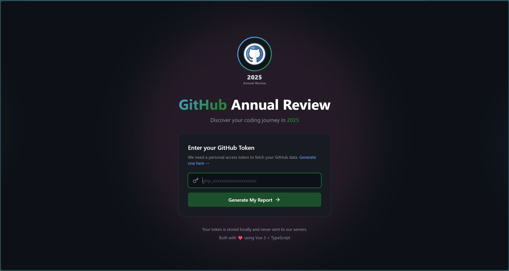
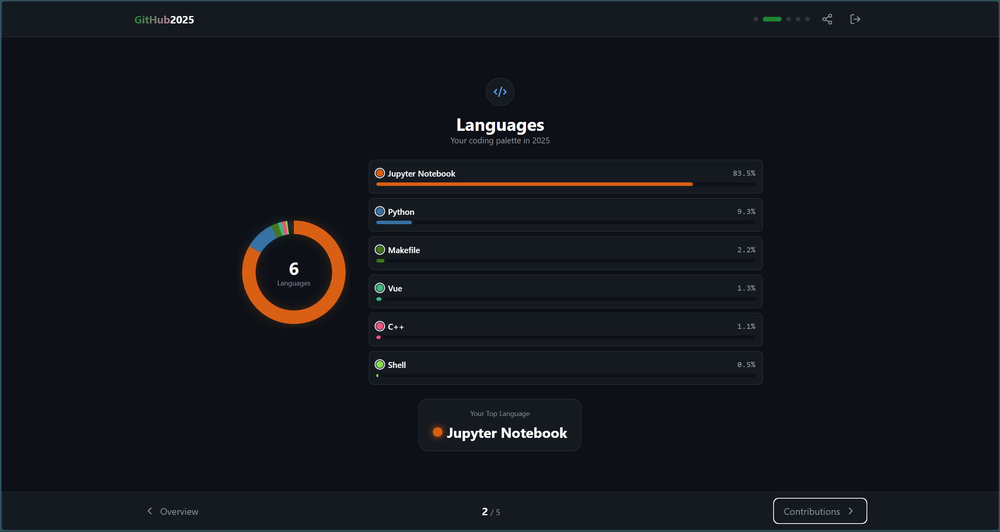
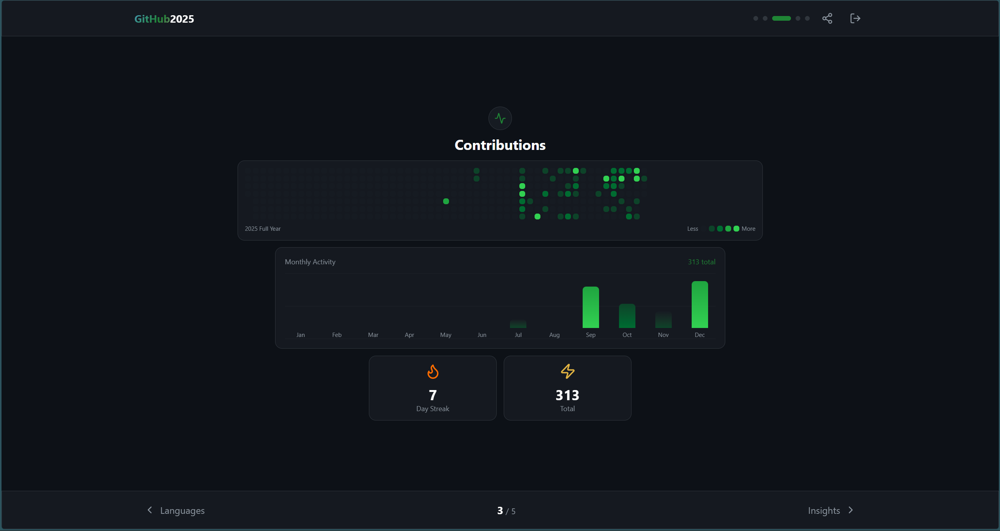
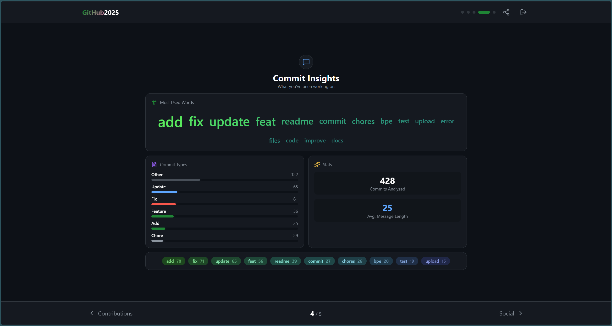
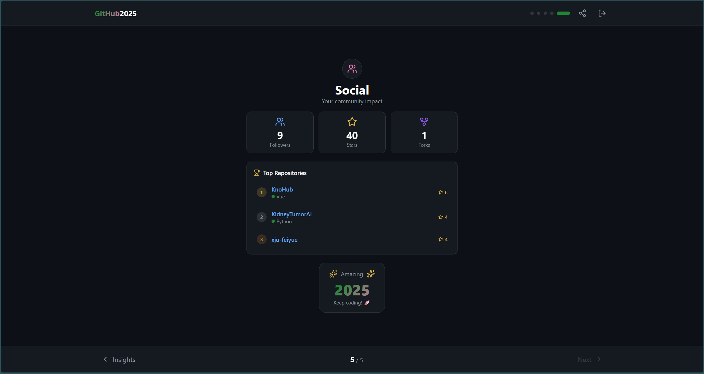

# 🎉 GitHub Annual Review

<p align="center">
  
</p>

> **Discover your coding journey in 2025** - A beautiful, interactive annual report for your GitHub contributions.


---

## ✨ Features

- 📊 **Comprehensive Statistics** - Total commits, PRs, issues, and stars
- 🌐 **Language Analysis** - Beautiful donut chart of your coding languages
- 🔥 **Contribution Heatmap** - Full-year contribution graph with animations
- 💬 **Commit Insights** - Word cloud and commit type analysis
- 👥 **Social Impact** - Followers, stars, and top repositories
- 🎨 **Beautiful UI** - Dark mode with GitHub-inspired design
- ✨ **Smooth Animations** - Engaging page transitions and number counters
- 📱 **Responsive** - Works on desktop and mobile devices

---

## 📸 Screenshots

### Login Page
Enter your GitHub Personal Access Token to generate your annual report.



### 1. Overview
Your year at a glance - total contributions, most active repo, and busiest day.


### 2. Languages
Discover your coding palette with an interactive donut chart.



### 3. Contributions
Full-year contribution heatmap and monthly activity chart.



### 4. Commit Insights
Word cloud analysis of your commit messages and commit type breakdown.



### 5. Social
Your community impact - followers, stars, and top repositories.



---

## 🚀 Quick Start

### Prerequisites

- Node.js 18+
- pnpm (recommended) or npm
- GitHub Personal Access Token with `read:user` and `repo` scopes

### Installation

```bash
# Clone the repository
git clone https://github.com/yourusername/github-annual-review.git
cd github-annual-review

# Install dependencies
pnpm install

# Start development server
pnpm dev
```

### Generate GitHub Token

1. Go to [GitHub Settings → Developer settings → Personal access tokens](https://github.com/settings/tokens/new?scopes=read:user,repo)
2. Select scopes: `read:user`, `repo`
3. Generate and copy the token
4. Paste it in the app

---

## 🛠️ Tech Stack

| Technology | Purpose |
|------------|---------|
| **Vue 3** | Frontend framework (Composition API) |
| **TypeScript** | Type safety |
| **Vite** | Build tool |
| **Tailwind CSS** | Styling |
| **Pinia** | State management |
| **Octokit** | GitHub API client |
| **Lucide Vue** | Icons |

---

## 📁 Project Structure

```
src/
├── components/
│   └── report/
│       ├── OverviewPage.vue      # Page 1: Year overview
│       ├── LanguagesPage.vue     # Page 2: Language stats
│       ├── ContributionsPage.vue # Page 3: Contribution graph
│       ├── CommitInsightsPage.vue# Page 4: Commit analysis
│       └── SocialPage.vue        # Page 5: Social stats
├── services/
│   └── github.ts                 # GitHub API service
├── stores/
│   └── github.ts                 # Pinia store
├── types/
│   └── github.ts                 # TypeScript types
├── views/
│   ├── LoginView.vue             # Token input page
│   └── ReportView.vue            # Report container
└── router/
    └── index.ts                  # Vue Router config
```

---

## 🔒 Privacy

- Your GitHub token is stored **locally** in your browser
- No data is sent to any third-party servers
- All API calls go directly to GitHub

---

## 📝 License

MIT License - feel free to use this project for your own GitHub annual review!

---

## 🤝 Contributing

Contributions are welcome! Feel free to:

1. Fork the repository
2. Create a feature branch (`git checkout -b feature/amazing-feature`)
3. Commit your changes (`git commit -m 'Add amazing feature'`)
4. Push to the branch (`git push origin feature/amazing-feature`)
5. Open a Pull Request

---

<p align="center">
  Made with ❤️ and ☕
  <br>
  <sub>Inspired by GitHub's annual review</sub>
</p>
